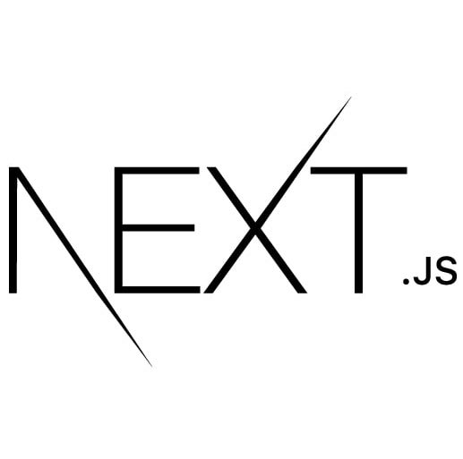
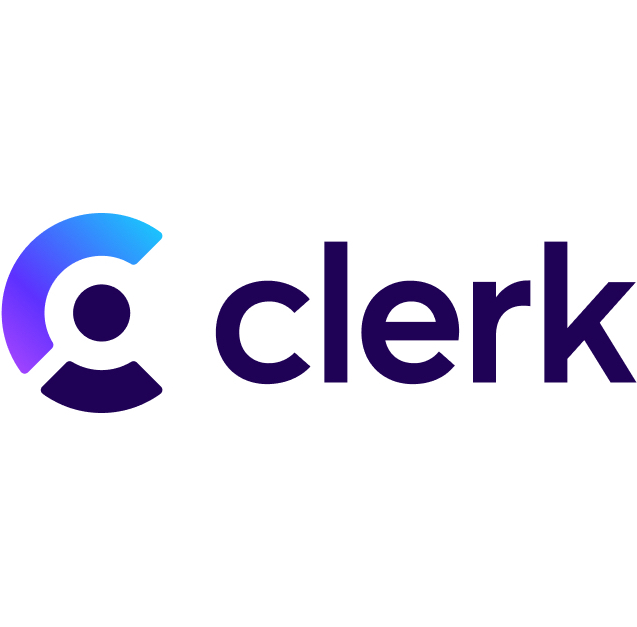

<h1 align="center">Gm! I'm Taveesha Agarwal</h1>
<h3 align="center">A passionate Developer who is enthusiastic about Web and Blockchain Development</h3>

- I’m currently learning **Solidity, Node and ExpressJS**
- 📫 Reach me at **taveesha.agarwal@gmail.com**
- 📄 Resume [https://drive.google.com/drive/folders/1qJVNCF6XYHeERhb1hJe86c-AcqvBJwH_?usp=sharing](https://drive.google.com/drive/folders/1qJVNCF6XYHeERhb1hJe86c-AcqvBJwH_?usp=sharing)

<h3 align="left">Connect with me:</h3>

<h3 align="left">Languages and Tools:</h3>

  <h4>Development</h4>
    
  
  
<!--     -->
  
  
   
   
    
  
     
  <h4>Design</h4>
   
  
  
  <h4>Other Tools/ Languages</h4>
   
       
  

&nbsp;

